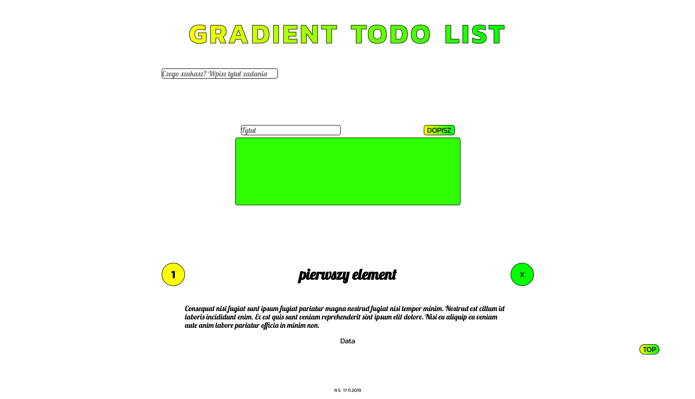

# Project screenshot

Simple TODO list with adding/deleting/searching functions.\
## Technologies used in project: 
- HTML5
- CSS3
- Vanilla JavaScript

### How to use Gulp:

`npm install -g gulp-cli`

`npm install`

`gulp`

